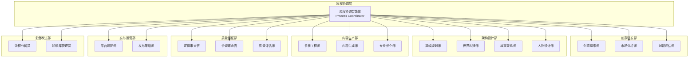
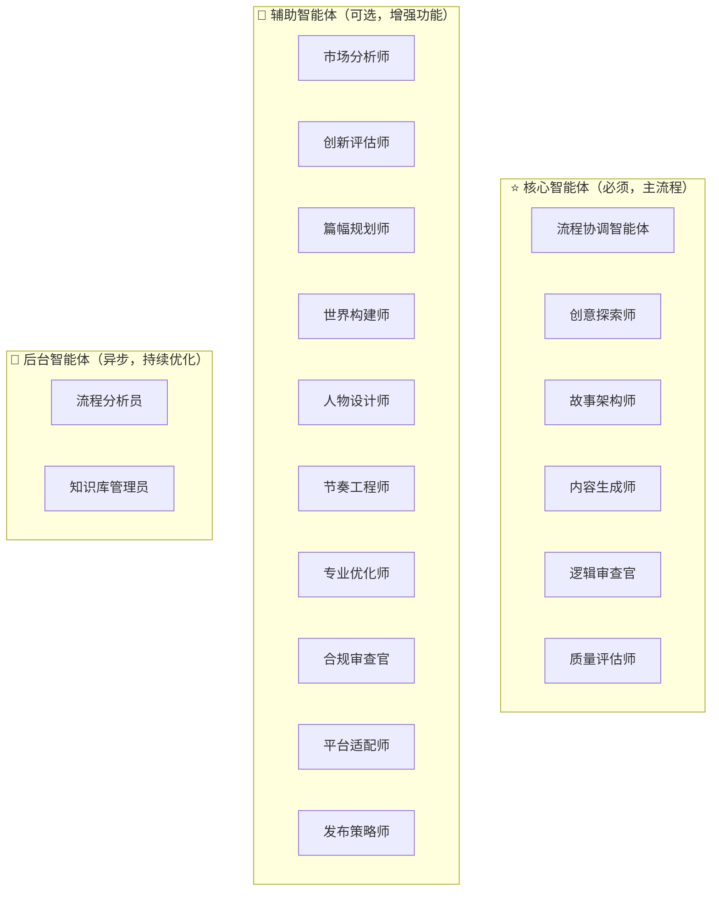
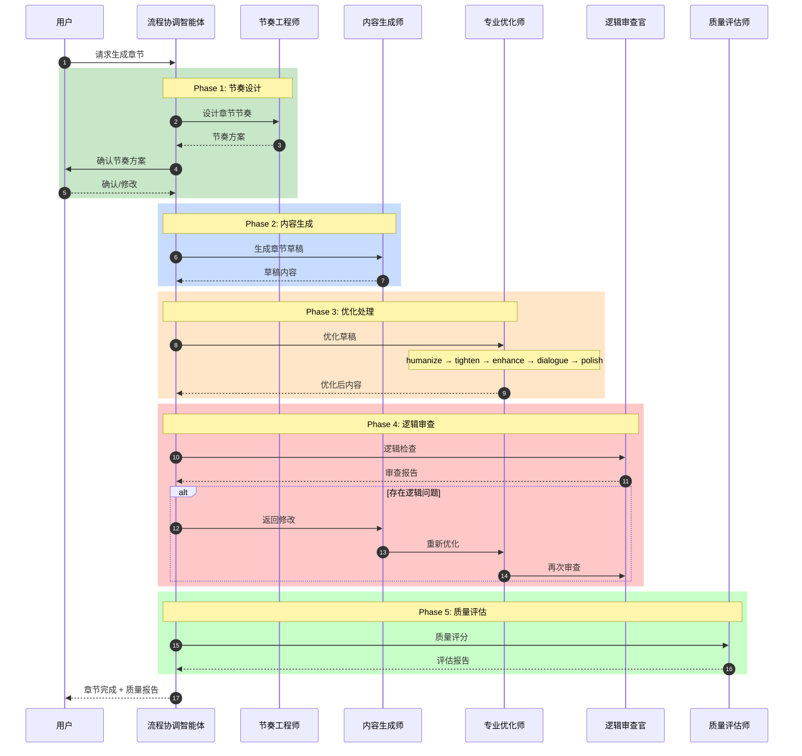
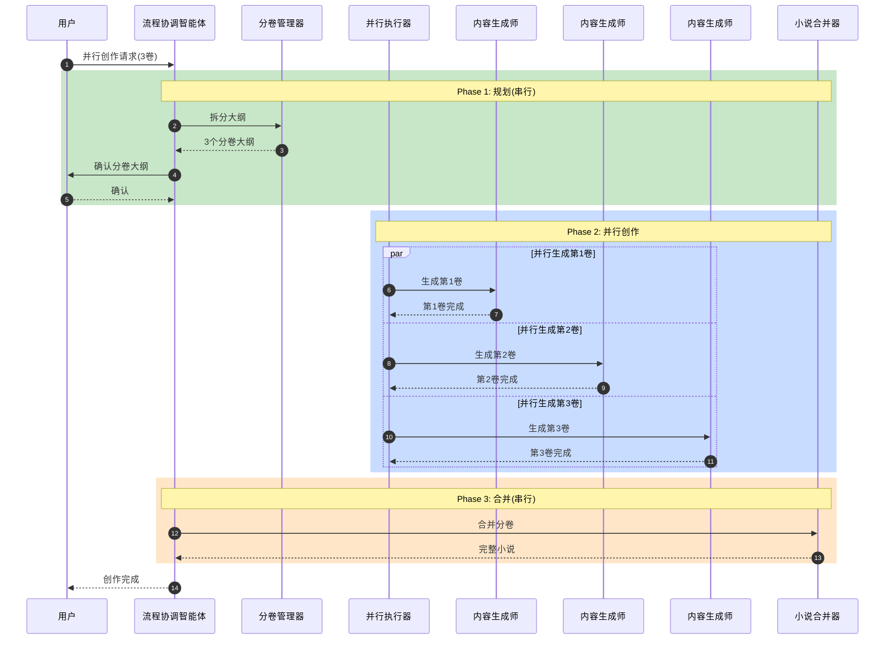
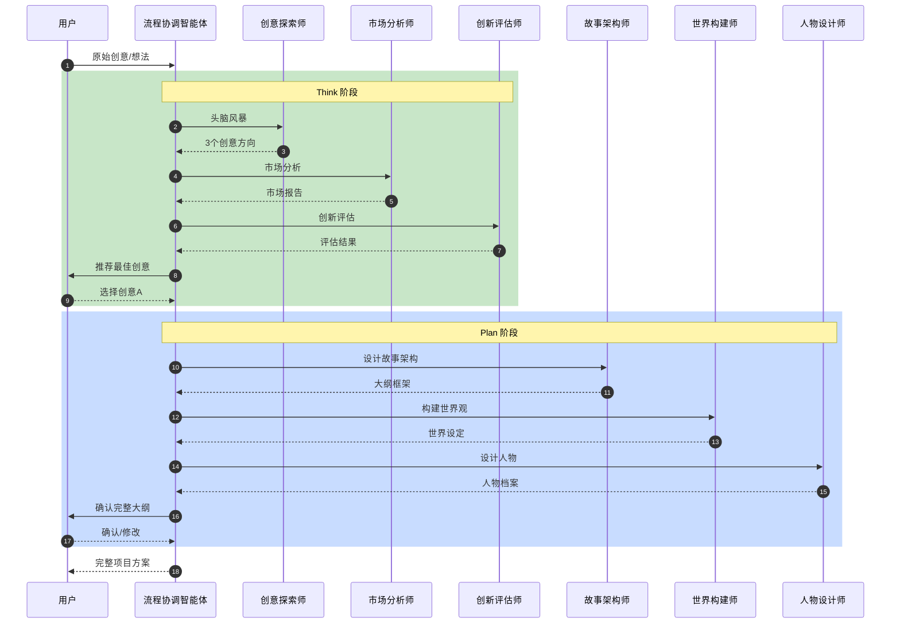
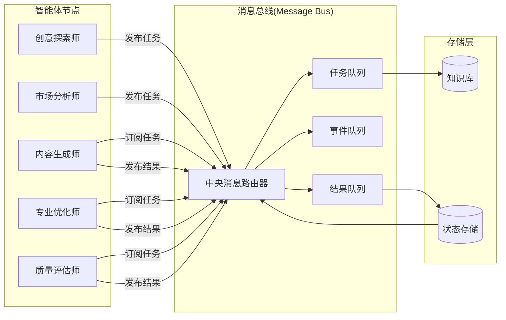
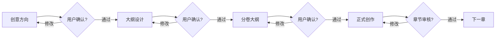

# NovelFlow 系统架构文档

## 一、系统架构图

### 1.1 核心智能体体系



### 1.2 核心与辅助智能体分离



---

## 二、核心流程时序图

### 2.1 章节生成流程



### 2.2 并行分卷创作流程



### 2.3 创意到大纲流程



---

## 三、消息总线架构

### 3.1 消息总线设计



### 3.2 消息格式标准

```yaml
消息类型:
  task: 任务消息
  event: 事件消息
  result: 结果消息
  query: 查询消息
  response: 响应消息

消息结构:
  id: "msg-uuid-xxx"
  timestamp: "2026-01-01T10:00:00Z"
  type: "task"  # task|event|result|query|response
  sender: "agent-name"
  receiver: "agent-name" | "broadcast"
  priority: "high" | "medium" | "low"
  payload:
    action: "generate_chapter"
    parameters: {}
    context: {}
  require_ack: true
  timeout: 300
```

---

## 四、技能效能评估

### 4.1 评估指标体系

| 指标         | 说明                           | 计算方式                  |
| ------------ | ------------------------------ | ------------------------- |
| 首次通过率   | 一次生成即通过质量评估的比例   | 通过数/总生成数           |
| 平均修改次数 | 达到发布标准需要的平均修改次数 | 总修改次数/章节数         |
| AI味道残留率 | 优化后AI特征的平均残留程度     | 检测到的AI特征数/总检查点 |
| 用户满意度   | 用户对生成内容的满意程度       | 满意评价数/总评价数       |

### 4.2 各技能基准值

| 技能     | 首次通过率基准 | AI味道残留率基准 |
| -------- | -------------- | ---------------- |
| 章节生成 | ≥60%           | <15%             |
| 对话优化 | ≥70%           | <10%             |
| 场景描写 | ≥65%           | <12%             |
| 战斗描写 | ≥60%           | <15%             |
| 情感渲染 | ≥55%           | <18%             |

---

## 五、作者干预节点

### 5.1 强制干预点



### 5.2 干预节点配置

| 节点     | 阶段  | 干预方式               | 超时处理         |
| -------- | ----- | ---------------------- | ---------------- |
| 创意确认 | Think | 选择/修改/重新生成     | 自动通过推荐方案 |
| 大纲确认 | Plan  | 确认/局部修改/重新设计 | 暂停等待         |
| 人物确认 | Plan  | 确认/修改/新增         | 暂停等待         |
| 分卷大纲 | Split | 确认/调整分卷点        | 暂停等待         |
| 章节审核 | Build | 通过/打回修改          | 自动进入下一章   |

---

## 六、知识管理结构

### 6.1 问题记录模板

```yaml
问题记录:
  id: "ISSUE-001"
  类型: "逻辑矛盾" | "AI味道" | "节奏问题" | "其他"
  场景: "第X章-Y场景"
  错误代码: "LOGIC-001"  # 预定义错误码
  描述: "问题详细描述"
  原因分析: "为什么会出错"
  解决方案: "如何修复"
  关联技能: ["logic-inspector", "specialist-optimizer"]
  预防措施: "如何避免同类问题"
  创建时间: "2026-01-01"
  状态: "open" | "resolved" | "closed"
```

### 6.2 经验沉淀模板

```yaml
经验记录:
  id: "EXP-001"
  类型: "成功经验" | "失败教训" | "最佳实践"
  适用场景: "玄幻题材战斗描写"
  核心内容: "具体方法或规则"
  效果验证: "应用后的效果数据"
  关联项目: ["项目A", "项目B"]
  创建时间: "2026-01-01"
  状态: "pending" | "verified" | "archived"
```

---

_文档版本: v1.1_
_更新时间: 2026-01-01_
_维护者: NovelFlow Architecture Team_
