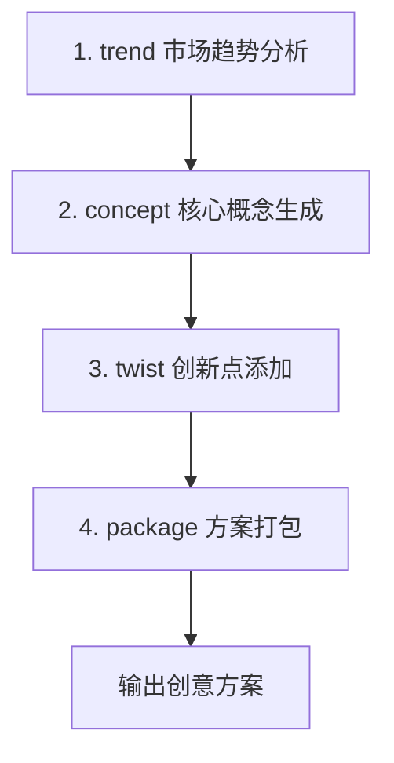

# 创意探索技能

## 使用场景

- 用户说"我不知道写什么"
- 用户要生成多个创意方案选择
- 用户要分析当前热门网文趋势
- 用户要针对某题材获取创意

---

## 命令

### full - 生成创意方案

```
/nf-idea-explorer full [--count <数量>] [--genre <题材>]
```

| 参数  | 类型   | 必填 | 默认值 | 说明     |
| ----- | ------ | ---- | ------ | -------- |
| count | number | 否   | 5      | 创意数量 |
| genre | string | 否   | -      | 题材方向 |

**执行流程**:



**执行方案**:

| 步骤       | 操作                                       | 产出       |
| ---------- | ------------------------------------------ | ---------- |
| 1. trend   | 分析目标题材的市场趋势、热门元素、读者偏好 | 趋势报告   |
| 2. concept | 结合趋势生成核心创意概念                   | 5个概念    |
| 3. twist   | 为每个概念添加独特创新点                   | 差异化卖点 |
| 4. package | 打包成完整创意方案                         | 输出方案   |

---

## 内部命令

### trend - 分析趋势

```
/nf-idea-explorer trend [--genre <题材>]
```

**执行方案**:

| 步骤 | 操作                       | 产出         |
| ---- | -------------------------- | ------------ |
| 1    | 分析目标题材的流行元素     | 热门标签列表 |
| 2    | 分析近期爆款作品的成功因素 | 成功要素     |
| 3    | 分析读者评论中的高频需求   | 读者期待     |
| 4    | 生成趋势报告               | 趋势摘要     |

**市场分析标准流程**:

### Phase 1: 数据采集

| 类型     | 来源       | 数据项                           |
| -------- | ---------- | -------------------------------- |
| 平台榜单 | 起点中文网 | 月票榜、推荐票榜、打赏榜、收藏榜 |
| 平台榜单 | 纵横中文网 | 推荐票榜、打赏榜                 |
| 平台榜单 | 晋江文学城 | 积分榜、营养液榜                 |
| 平台榜单 | 番茄小说   | 飙升榜、完读率榜                 |
| 读者互动 | 评论分析   | 高频词（前100条）                |
| 读者互动 | 书评分析   | 情绪倾向（正/中/负）             |
| 读者互动 | 互动活跃   | 段评/章评活跃度                  |
| 竞品分析 | 同类TOP10  | 平均成绩                         |
| 竞品分析 | 新书榜     | 该题材占比                       |

### Phase 2: 维度分析

| 维度     | 分析项                              | 创新空间               |
| -------- | ----------------------------------- | ---------------------- |
| 升级体系 | 系统流/功法流/血脉流/天赋流/交易流  | 红海/蓝海              |
| 世界观   | 都市/异界/星际/洪荒/现代修真        | 独特法则/日常化/反差化 |
| 人物设定 | 主角：废物流/天才流/腹流氓/阳光流   | 配角创新空间           |
| 人物设定 | 女主：圣女/魔女/青梅/病娇/御姐      | -                      |
| 金手指   | 类型：抽奖/任务/击杀/签到/传承/记忆 | 弱/中/强               |
| 剧情套路 | 退婚/系统/凡是/学院/宗门            | 反套路创新点           |
| 文风类型 | 轻松/严肃/幽默/虐心/烧脑            | 快/慢节奏              |

### Phase 3: 趋势研判

| 输出项        | 说明         |
| ------------- | ------------ |
| 热门元素TOP20 | 出现频率统计 |
| 读者期待      | 评论高频诉求 |
| 市场机会      | 差异化突破口 |

**题材分类市场分析标准**:

| 题材   | 核心人群 | 热门元素                 | 平均字数  | 付费率 | 创新方向建议           |
| ------ | -------- | ------------------------ | --------- | ------ | ---------------------- |
| 玄幻   | 18-35男  | 系统流、凡人流、宗门战争 | 300-500万 | 8-12%  | 世界观重构、体系创新   |
| 都市   | 20-40男  | 总裁、修仙、医术、战神   | 200-400万 | 10-15% | 职业深耕、异能设定     |
| 仙侠   | 22-38男  | 古典仙侠、蜀山、凡人流   | 300-500万 | 7-10%  | 古典创新、现代仙侠     |
| 奇幻   | 20-35男  | 魔法、异界、召唤、领主   | 250-450万 | 6-9%   | 设定新颖、力量体系创新 |
| 轻小说 | 15-25    | 转生、异世界、日常、冒险 | 100-200万 | 5-8%   | 题材融合、反套路       |
| 历史   | 25-45男  | 穿越、架空、军事、朝堂   | 200-400万 | 9-12%  | 视角创新、专业度提升   |
| 科幻   | 20-35男  | 星际、进化、末日、系统   | 200-350万 | 5-8%   | 设定创新、情感线强化   |
| 游戏   | 18-30男  | 虚拟现实、游戏副本、电竞 | 150-300万 | 7-10%  | 玩法创新、现实联动     |

**分析方法**:

1. 输入： 题材（玄幻）
2. 数据源： 起点月票榜、纵横推荐榜、读者评论
3. 分析维度： 升级体系（系统/功法/血脉）、女主类型（圣女/魔女/青梅）、战斗场景（宗门战争/天才流/凡人流）、金手指（抽奖/任务/击杀）
4. 输出： 趋势报告, 包含热门元素、读者期待、市场机会、风险评估

**市场趋势报告标准模板**:

| 字段          | 说明               |
| ------------- | ------------------ |
| report_id     | TREND-YYYYMMDD-XXX |
| genre         | 题材               |
| analysis_date | 分析日期           |
| data_sources  | 数据来源列表       |

**热门元素**:

| 类型     | 元素       | 热度 | 趋势 | 读者反馈 |
| -------- | ---------- | ---- | ---- | -------- |
| 升级体系 | 系统流     | 95   | 上升 | 又爱又恨 |
| 女主     | 多女主     | 88   | 稳定 | -        |
| 金手指   | 任务奖励型 | 90   | 稳定 | -        |

**读者期待**:

| 维度 | 内容             |
| ---- | ---------------- |
| 节奏 | 快节奏、打脸干脆 |
| 情感 | 爽、热血、不憋屈 |
| 剧情 | 有智商、不小白   |

**市场机会**:

| 分类   | 内容                               |
| ------ | ---------------------------------- |
| 蓝海   | 反套路系统、新职业设定、多元素融合 |
| 差异化 | 世界观创新、人设反差、节奏把控     |

**风险评估**:

| 分类   | 元素               |
| ------ | ------------------ |
| 过饱和 | 传统系统流、退婚流 |
| 下滑中 | 纯凡人流           |

---

### concept - 生成概念

```
/nf-idea-explorer concept [--genre <题材>] [--count <数量>]
```

**执行方案**:

| 步骤 | 操作                     | 产出                     |
| ---- | ------------------------ | ------------------------ |
| 1    | 提取趋势报告中的热门元素 | 元素组合                 |
| 2    | 随机打散元素             | 创新组合                 |
| 3    | 生成核心设定             | 主角身份+世界背景+金手指 |
| 4    | 生成剧情主线             | 3段式结构                |

**生成方法**:

1. 输入： 趋势报告
2. 元素提取： 从趋势报告中提取3-5个热门元素
3. 差异化组合： 将元素进行非传统组合，如"最弱系统"=系统流+凡人流
4. 核心设定生成： 主角(身份/处境/天赋)、世界(背景/规则/势力)、目标(短期/中期/长期)
5. 剧情结构： 开头:困境/觉醒、中段:成长/冲突、高潮:逆转/爆发
6. 输出： 生成的核心概念

**核心概念生成标准方法论**:

| 方法               | 操作                                     | 示例                                                  |
| ------------------ | ---------------------------------------- | ----------------------------------------------------- |
| **M1: 元素拆解法** | 将热门元素拆解为更小单元，跨类别重新组合 | "系统流"→系统类型+奖励类型+惩罚机制，组合=惩罚系统流  |
| **M2: 反向思维法** | 将热门元素反转，保留原有爽点             | 最强系统→最弱系统，最弱系统+隐藏实力=看似废物实则大佬 |
| **M3: 元素融合法** | 将两个以上元素融合为一个新概念           | 都市+修仙+宠物=都市灵兽师                             |
| **M4: 场景迁移法** | 将某元素移植到新场景，带来新冲突         | 修仙体系→现代都市，魔法学院→古代朝堂                  |
| **M5: 缺失补全法** | 找到某题材中缺失的元素并补全             | 系统流缺失:系统会消失/进化/有意识                     |

**概念创意矩阵**:

| 横向元素 | + 都市   | + 异界   | + 星际   | + 古代   | + 现代   |
| -------- | -------- | -------- | -------- | -------- | -------- |
| 系统流   | 都市系统 | 异界系统 | 星际系统 | 朝廷系统 | 商战系统 |
| 凡人流   | 都市凡人 | 异界凡人 | 星际凡人 | 科举凡人 | 职场凡人 |
| 召唤流   | 都市召唤 | 异界召唤 | 星际召唤 | 妖召唤   | 灵宠召唤 |
| 抽奖流   | 都市抽奖 | 异界抽奖 | 星际抽奖 | 江湖抽奖 | 都市抽奖 |
| 任务流   | 都市任务 | 异界任务 | 星际任务 | 朝廷任务 | 职场任务 |

**主角设定标准模板**:

```json
{
  "protagonist_design": {
    "identity_template": {
      "surface_identity": "表面身份(让读者产生反差感)",
      "hidden_identity": "隐藏身份(核心悬念)",
      "identity_conflict": "身份矛盾点"
    },
    "situation_templates": {
      "starting_point": "起始处境(限制条件)",
      "development_space": "成长空间(升级路径)",
      "final_state": "终极目标"
    },
    "talent_templates": {
      "apparent_talent": "表面天赋(高/中/低)",
      "real_talent": "真实天赋(隐藏的绝世天赋)",
      "talent_type": ["修炼天赋", "战斗天赋", "特殊天赋"]
    },
    "personality_templates": {
      "core_personality": "核心性格",
      "behavior_pattern": "行为模式",
      "speech_style": "说话风格"
    }
  }
}
```

**输出格式**:

```json
{
  "concept_id": 1,
  "title": "都市修仙：废物逆袭，校花倒贴",
  "tags": ["都市", "修仙", "热血", "爽文"],
  "protagonist": {
    "identity": "废物上门女婿",
    "situation": "被家族抛弃、被妻子冷落",
    "talent": "隐藏的修仙天赋"
  },
  "world": {
    "setting": "现代都市+修仙界",
    "rule": "都市隐修+灵气复苏"
  },
  "golden_finger": "上古修仙传承",
  "highlight": "身份反差+扮猪吃虎"
}
```

**概念创意质量评估标准**:

| 评估维度   | 权重 | 评分标准                   | 达标分数 |
| ---------- | ---- | -------------------------- | -------- |
| 差异化程度 | 30%  | 与同类作品的区分度、独特性 | ≥8/10    |
| 延展性     | 25%  | 能否支撑100万字以上的剧情  | ≥7/10    |
| 代入感     | 20%  | 读者能否快速产生共鸣       | ≥8/10    |
| 爽点密度   | 15%  | 核心爽点是否明确、可持续   | ≥7/10    |
| 市场适配度 | 10%  | 是否符合当前市场趋势       | ≥6/10    |

---

### twist - 添加创新

```
/nf-idea-explorer twist [--base <基础概念>]
```

**执行方案**:

| 步骤 | 操作                   | 产出       |
| ---- | ---------------------- | ---------- |
| 1    | 分析基础概念的核心爽点 | 爽点定位   |
| 2    | 寻找同类作品的套路     | 常见套路   |
| 3    | 设计反套路创新         | 差异化设计 |
| 4    | 生成独特卖点           | 创新标签   |

**创新方法**:

| 步骤   | 操作       | 要点                                     |
| ------ | ---------- | ---------------------------------------- |
| Step 1 | 爽点分析   | 这个概念的核心爽点是什么？读者期待什么？ |
| Step 2 | 套路列举   | 同类作品常见写法？读者已经看腻的元素？   |
| Step 3 | 反套路设计 | 保留核心爽点，替换/反转套路元素          |
| Step 4 | 卖点包装   | 一句话概括独特卖点，生成吸引人的标题     |

**反套路设计标准方法**:

### 第一类: 保留爽点、反转形式

| 原套路 | 变形设计          | 核心爽点           | 创新点                         |
| ------ | ----------------- | ------------------ | ------------------------------ |
| 退婚流 | 婚约存在但有问题  | 逆袭打脸           | 发现真相后主动退               |
| 系统流 | 系统进化/系统博弈 | 获得资源、快速成长 | 系统有自己的意志，可以讨价还价 |
| 废物流 | 隐藏天才          | 扮猪吃虎           | 天赋藏不住，时刻面临暴露风险   |

### 第二类: 保留框架、替换元素

| 原套路 | 变形设计       | 核心爽点   | 创新点                         |
| ------ | -------------- | ---------- | ------------------------------ |
| 宗门流 | 只有主角的宗门 | 成长、崛起 | 宗门只有自己，需要自己培养自己 |
| 学院流 | 学术研究型学院 | 修炼、竞争 | 比的不是战斗力，而是学术成果   |
| 升级流 | 可交易的等级   | 实力提升   | 等级可以买、卖、偷、赌         |

### 第三类: 多元素融合创造新品类

| 融合方式        | 新品类     | 核心爽点           | 创新点                           |
| --------------- | ---------- | ------------------ | -------------------------------- |
| 系统流 + 经营流 | 系统经营流 | 资源积累、势力扩张 | 系统发布经营任务，奖励是经营点数 |
| 穿越流 + 美食流 | 异界美食流 | 独特能力、获得认可 | 用美食征服修仙界                 |
| 星际流 + 召唤流 | 星际召唤流 | 召唤助力、战斗     | 召唤星际战舰、异星生物           |

### 第四类: 极端化处理

| 类型     | 设计               | 核心爽点 | 创新点                             |
| -------- | ------------------ | -------- | ---------------------------------- |
| 最弱开局 | 极限困境中求突破   | 绝地逆袭 | 资源匮乏到极致，每一步都是生死抉择 |
| 最强系统 | 无敌流的开局即巅峰 | 无敌碾压 | 巅峰后面临的全新挑战               |
| 最慢升级 | 厚积薄发的极致     | 后期爆发 | 前期的每一次进步都极其艰难         |

**反套路示例**:

| 常见套路 | 反套路设计                     |
| -------- | ------------------------------ |
| 退婚流   | 不退婚，但发现是童养媳         |
| 系统流   | 系统是最弱系统，任务失败有惩罚 |
| 升级流   | 等级可交易，可以买等级         |
| 宗门流   | 宗门只有主角一人               |
| 功法流   | 功法会进化，但会反噬           |

**创新卖点生成标准**:

| 卖点类型   | 生成方法                       | 示例                             |
| ---------- | ------------------------------ | -------------------------------- |
| 身份反差   | 表面身份与真实身份形成强烈对比 | 废物赘婿是上古传承人             |
| 能力反差   | 表面能力与隐藏能力形成对比     | 看起来是治疗师实际是暴力输出     |
| 世界观创新 | 构建独特的世界规则             | 灵气=金钱，修炼=打工             |
| 关系创新   | 人物关系的独特设计             | 敌人是女主/系统有自己的意识      |
| 目标创新   | 主角目标的独特性               | 不追求成神，追求的是XX           |
| 方法创新   | 实现目标的方法与众不同         | 不是打怪升级，而是通过XX方式变强 |

---

## 创意概念库

### 都市类创意模板

| 模板ID | 题材融合  | 核心创意         | 爽点类型  |
| ------ | --------- | ---------------- | --------- |
| U-001  | 都市+系统 | 惩罚系统流       | 绝地逆袭  |
| U-002  | 都市+修仙 | 上门女婿修仙     | 身份反转  |
| U-003  | 都市+奶爸 | 奶爸带娃修仙     | 温馨+热血 |
| U-004  | 都市+医生 | 都市小医生       | 医术+权贵 |
| U-005  | 都市+兵王 | 战场兵王回归都市 | 装逼打脸  |

### 玄幻类创意模板

| 模板ID | 题材融合    | 核心创意       | 爽点类型 |
| ------ | ----------- | -------------- | -------- |
| X-001  | 玄幻+系统   | 最弱系统流     | 逆境求存 |
| X-002  | 玄幻+凡人流 | 觉醒最晚的天才 | 大器晚成 |
| X-003  | 玄幻+召唤   | 唯一召唤师     | 独特地位 |
| X-004  | 玄幻+宗门   | 宗主流         | 势力经营 |
| X-005  | 玄幻+血脉   | 血脉变异       | 血统觉醒 |

### 奇幻类创意模板

| 模板ID | 题材融合  | 核心创意      | 爽点类型     |
| ------ | --------- | ------------- | ------------ |
| Q-001  | 奇幻+领主 | 异界领主种田  | 经营建设     |
| Q-002  | 奇幻+魔法 | 魔法学霸      | 知识就是力量 |
| Q-003  | 奇幻+龙   | 屠龙者/驭龙者 | 战斗+伙伴    |
| Q-004  | 奇幻+异界 | 异界求生      | 生存挑战     |
| Q-005  | 奇幻+精灵 | 精灵族学者    | 知识+自然    |

### 仙侠类创意模板

| 模板ID | 题材融合    | 核心创意     | 爽点类型  |
| ------ | ----------- | ------------ | --------- |
| S-001  | 仙侠+古典   | 蜀山剑修     | 剑道锋芒  |
| S-002  | 仙侠+朝堂   | 修士入朝     | 权谋+修为 |
| S-003  | 仙侠+凡人流 | 山野散修     | 草根逆袭  |
| S-004  | 仙侠+现代   | 现代灵气复苏 | 都市修仙  |
| S-005  | 仙侠+洪荒   | 洪荒穿越     | 圣人之争  |

---

## 输出示例

**full 命令输出**:

```
[1] 都市修仙：废物逆袭，校花倒贴
    标签：都市｜修仙｜热血｜爽文
    亮点：身份反差+系统流+打脸
    简介：废物上门女婿意外觉醒修仙天赋，在都市掀起修仙风暴

[2] 异世穿越：成为史上最弱召唤师
    标签：奇幻｜穿越｜召唤流
    亮点：反套路+宠物成长体系
    简介：穿越异世成为召唤师，但召唤兽是最弱史莱姆

[3] 玄幻：高武世界的大器晚成
    标签：玄幻｜高武｜凡人流
    亮点：慢热+厚积薄发
    简介：19岁才感知到灵气，被认为是废物，实则是绝世天才
```

---

## 错误处理

| 错误码 | 说明         | 处理方式                  |
| ------ | ------------ | ------------------------- |
| IE-001 | 题材无效     | 使用通用题材（玄幻/都市） |
| IE-002 | 数量无效     | 默认5个                   |
| IE-003 | 数据获取失败 | 使用历史趋势数据          |
| IE-004 | 生成失败     | 返回降级方案              |

**错误恢复流程**:

```
IE-001/IE-002: 使用默认配置重新生成
IE-003: 切换到缓存数据源，标注"数据可能滞后"
IE-004: 输出基础创意框架，允许用户手动补充
```
